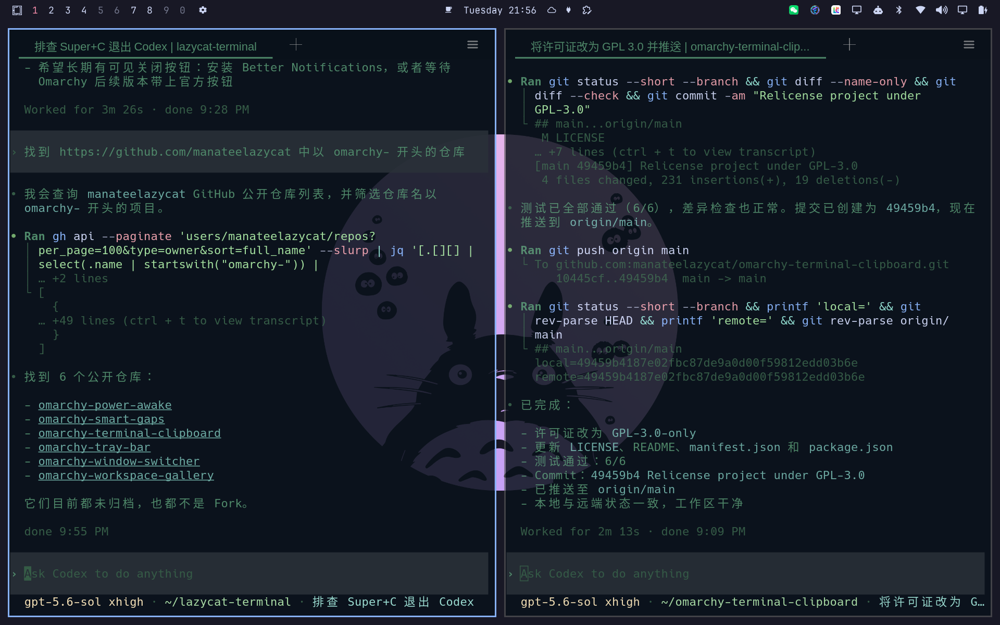

# Omarchy Terminal Clipboard



An [Omarchy](https://omarchy.org/) plugin that makes `Super+C` and `Super+V` work consistently across regular applications, terminals, Lazycat Terminal, and LightOS by sending the appropriate copy and paste key combinations for each window.

## Install

```bash
omarchy plugin add https://github.com/manateelazycat/omarchy-terminal-clipboard.git --enable
```

No additional configuration is required.

## Behavior

| Active window | `Super+C` sends | `Super+V` sends |
| --- | --- | --- |
| Lazycat Terminal (`class = com.lazycat.terminal`) | `Ctrl+Shift+C` | `Ctrl+Shift+V` |
| LightOS (`initial_title` starts with `cloud.lazycat.lightos`) | `Ctrl+Shift+C` | `Ctrl+Shift+V` |
| Terminal recognized by Omarchy | `Ctrl+Insert` | `Shift+Insert` |
| Other application | `Ctrl+C` | `Ctrl+V` |

The LightOS match deliberately ignores the user-specific domain suffix. Runtime bindings are reapplied automatically after a Hyprland configuration reload.

## Status

```bash
omarchy-shell io.github.manateelazycat.terminal-clipboard status
```

## Remove

```bash
omarchy plugin remove io.github.manateelazycat.terminal-clipboard
```

When the plugin unloads, it restores Omarchy's default universal clipboard bindings.

## Requirements

- Omarchy with the Quickshell plugin system
- Hyprland with Lua configuration support

## Development

```bash
npm test
omarchy plugin validate .
qmllint -I "$OMARCHY_PATH/shell" Service.qml
```

## License

GNU General Public License v3.0 only. See [LICENSE](LICENSE).
